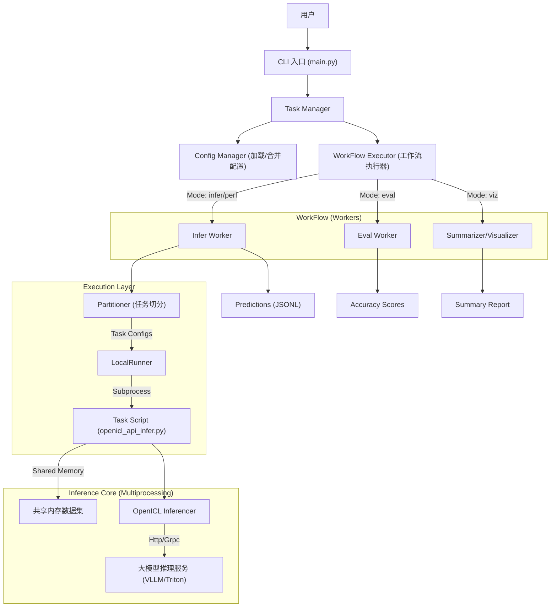
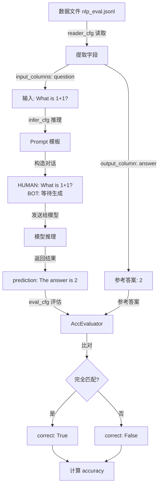

# AISBench 架构分析报告

## 1. 项目概览

**AISBench Benchmark** 是一个面向大模型（LLM）的综合评测工具，主要基于 [OpenCompass](https://github.com/open-compass/opencompass) 构建，但在其基础上进行了深度定制，特别增强了对**服务化模型（Service-oriented Models）**的支持。

### 核心特性

- **双重模式**：支持**精度评测**（基于数据集的问答准确率）和**性能评测**（吞吐量、延迟、RPS等）。
- **高并发架构**：针对服务化推理场景，底层采用多进程+共享内存机制，支持高并发请求发送。
- **插件化设计**：通过 Registry 机制管理模型、数据集、运行器等组件，易于扩展。
- **全面兼容**：支持 VLLM, Triton, TGI 等主流推理服务框架。

---

## 2. 系统架构设计

本项目采用分层架构，数据流从 CLI 入口层层传递至底层的模型执行单元。

### 2.1 核心层级流转图



### 2.2 核心流程解析

1. **配置解析 (CLI & Config)**:
    - 用户通过 `ais_bench --models ... --datasets ...` 启动。
    - `TaskManager` 调用 `ConfigManager` 加载对应的 Python 配置文件。
    - 系统根据运行模式（`infer`, `eval`, `perf`）组装工作流（Workflow）。

2. **任务调度 (Workers & Runners)**:
    - `Worker`（如 `Infer`）负责准备具体的任务配置，并调用 `Partitioner`（默认 `NaivePartitioner`）将大任务切分为子任务。
    - `LocalRunner` 接收任务列表，使用线程池（ThreadPoolExecutor）管理任务的并发提交。
    - **关键机制**：`LocalRunner` 不会直接在当前进程执行模型代码，而是将配置 dump 为临时文件，然后通过 `subprocess.Popen` 启动一个新的 Python 进程来执行具体的 Task 脚本（如 `ais_bench/benchmark/tasks/openicl_api_infer.py`）。

3. **高并发推理 (Tasks & Inferencer)**:
    - 在子进程中，`OpenICLApiInferTask` 启动。
    - **性能优化**：为了支持高并发压测，Task 使用 `multiprocessing` 启动多个 Worker 进程。
    - **数据共享**：主进程将数据集序列化到 **Shared Memory (共享内存)**，子进程直接从共享内存读取数据，避免了进程间通信的大量开销。
    - `TokenProducer` 负责控制请求速率（Rate Limiting），模拟真实流量压力。

---

## 3. 核心模块说明

| 模块 | 路径 | 作用 |
| :--- | :--- | :--- |
| **Registry** | `ais_bench/benchmark/registry.py` | 核心注册中心，管理所有插件（Models, Datasets, Runners）。基于 `mmengine.registry`。 |
| **CLI** | `ais_bench/benchmark/cli/` | 程序入口，负责参数解析、工作流编排 (`workers.py`)。 |
| **Runners** | `ais_bench/benchmark/runners/` | 任务执行器。`LocalRunner` 负责本地多任务调度，核心是管理 GPU/NPU 资源并启动子进程。 |
| **Tasks** | `ais_bench/benchmark/tasks/` | 具体的执行逻辑。`OpenICLApiInferTask` 是服务化推理的核心，实现了多进程共享内存架构。 |
| **Models** | `ais_bench/benchmark/models/` | 模型接口抽象。分为 `local_models` (HuggingFace) 和 `api_models` (VLLM, Triton)。 |
| **Inferencer** | `ais_bench/benchmark/openicl/` | 推理核心逻辑，负责将 Dataset 中的数据转换为 Prompt 并发送给 Model。 |
| **Calculators** | `ais_bench/benchmark/calculators/` | 性能指标计算（TPS, Latency, TTFT 等）。 |
| **Summarizers** | `ais_bench/benchmark/summarizers/` | 结果汇总，生成 CSV/Markdown 报告。 |

---

## 4. 核心 Worker 机制解析

`ais_bench/benchmark/cli/workers.py` 定义了评测流程中的核心执行单元。`WorkFlowExecutor` 根据运行模式（如 `infer` 或 `perf`）调度这些 Worker。

### 4.1 核心 Worker 详解

#### 1. `Infer` (推理工作者)

**核心职责**：调用模型进行数据推理，生成预测结果。

- **任务类型判断**：检查配置中的模型属性。若为服务化模型 (`attr="service"`)，使用 `OpenICLApiInferTask`（支持多进程+共享内存高并发）；本地模型则使用 `OpenICLInferTask`。
- **任务切分与执行**：调用 `Partitioner` 切分任务，通过 `Runner` 调度执行。
- **性能评测优化**：在 `perf` 模式下，执行 `_merge_datasets`，将相同配置的数据集任务合并，以消除任务切换开销，确保持续高并发压力。

#### 2. `Eval` (评估工作者)

**核心职责**：对推理生成的预测结果与标准答案进行比对。

- **流程**：配置 `OpenICLEvalTask`，生成中间评估结果（存放在 `results/` 目录）。
- **注意**：在性能评测模式下通常跳过此步骤。

#### 3. `AccViz` (精度结果汇总)

**核心职责**：汇总 `Eval` 阶段数据，生成精度报告。

- **产出**：CSV/Markdown 报告，计算 Accuracy, F1 Score 等指标。
- **支持**：包含对主观评测（Subjective Evaluation）的特殊汇总逻辑。

#### 4. `PerfViz` (性能结果汇总)

**核心职责**：计算和展示性能评测指标（仅在 `perf` 模式下工作）。

- **产出**：计算 **TPS** (Tokens Per Second), **TTFT**, **Latency**, **RPS** 等关键指标，生成性能分析报告。

### 4.2 工作流编排 (WorkFlow)

| 模式 (`--mode`) | 执行链 (Pipeline) | 说明 |
| :--- | :--- | :--- |
| **all** (默认) | `Infer` -> `Eval` -> `AccViz` | 完整精度评测流程 |
| **perf** | `Infer` -> `PerfViz` | 性能评测流程（跳过算分） |
| **infer** | `Infer` | 仅执行推理 |
| **eval** | `Eval` -> `AccViz` | 仅算分和汇总 |

---

## 5. 精度评测 vs 性能评测

在 AISBench 中，两者的目标、关注点及底层逻辑存在本质区别：

| 维度 | 精度测量 (Accuracy) | 性能测量 (Performance) |
| :--- | :--- | :--- |
| **核心问题** | **“模型回答得对不对？”** | **“模型回答得快不快？系统能抗多大压？”** |
| **关注指标** | Accuracy, Pass@k, ROUGE, BLEU | TPS, TTFT, Latency, QPS/RPS |
| **是否合并任务** | **否** (独立计算各数据集分数) | **是** (合并以维持持续压力，测出峰值性能) |
| **对服务端压力** | 较低 (关注单条质量) | **极高** (模拟真实高并发流量) |
| **执行流程** | `Infer` -> `Eval` -> `AccViz` | `Infer` -> `PerfViz` (跳过 `Eval`) |
| **启动命令** | `ais_bench ...` | `ais_bench --mode perf ...` |

---

## 6. 模型加载与配置机制

AISBench 采用 **Configuration as Code** 的设计模式，将模型实现与配置分离。

### 6.1 目录职责

- **实现层 (`benchmark/models/`)**: 定义模型的 Python 类（如 `VLLMCustomAPIChat`, `HuggingFace`），实现具体的推理逻辑。

- **配置层 (`configs/models/`)**: 定义具体的 Python 配置文件（如 `qwen.py`），实例化模型类并填充参数（如 IP、端口、并发数）。

### 6.2 动态加载流程

当执行 `ais_bench --models qwen` 时：

1. **搜索**: 系统在 `configs/models/` 下查找 `qwen.py`。
2. **执行**: 动态运行该 Python 脚本。
3. **注入**: 提取脚本中定义的 `models` 列表，将其注入到 `ConfigManager` 中。
4. **实例化**: 根据配置中的 `type` 字段（如 `type=MaaSAPI`）实例化对应的模型类。

这种机制允许用户在配置文件中使用 Python 代码（如循环生成配置、环境变量读取），极大地提升了灵活性。

---

## 7. 如何运行一个新的测评任务

如果你想测试一个新的大模型测评任务，请遵循以下步骤：

### 第一步：准备模型配置

在 `ais_bench/benchmark/configs/models/` 下创建或复用配置文件。
例如 `vllm_api_new.py`:

```python
from ais_bench.benchmark.models import VLLMCustomAPIChat

models = [
    dict(
        attr="service",
        type=VLLMCustomAPIChat,
        abbr='vllm-new-model',
        host_ip="127.0.0.1",
        host_port=8000,
        batch_size=16,  # 并发数
        generation_kwargs=dict(temperature=0.0)
    )
]
```

### 第二步：准备数据集

确保数据集已在 `ais_bench/benchmark/configs/datasets/` 中定义。如果是自定义数据集，需要配置加载器和评估指标。

### 第三步：启动推理服务

确保你的大模型服务（如 VLLM）已经启动并监听在配置文件指定的端口。

### 第四步：执行命令

使用 CLI 启动评测：

```bash
# 精度评测 (默认)
ais_bench --models vllm_api_new --datasets demo_gsm8k_chat

# 性能评测 (指定 --mode perf)
ais_bench --mode perf --models vllm_api_new --datasets demo_gsm8k_chat
```

### 第五步：查看结果

执行完成后，结果位于 `outputs/default/{timestamp}/` 目录下：

- `logs/`: 运行日志。
- `predictions/`: 模型输出的原始 JSONL 文件。
- `results/`: 精度计算结果。
- `summary/`: 最终的性能或精度汇总报告。

## 8. 数据集配置详解

### 8.1 配置文件结构

AISBench 的数据集配置采用 Python 字典结构，包含以下几个核心部分：

```python
dataset = dict(
    # 基础配置
    abbr="数据集缩写名称",
    type=数据集类型,
    path="数据文件路径",
    
    # 数据读取配置
    reader_cfg=dict(...),
    
    # 推理配置
    infer_cfg=dict(...),
    
    # 评估配置
    eval_cfg=dict(...)
)
```

### 8.2 配置参数详解

以 `custom_eval_suite.py` 中的 `nlp_eval_acc_dataset` 为例：

```python
nlp_eval_acc_dataset = dict(
    # ========== 基础配置 ==========
    abbr="demo_nlp_eval_acc",
    # 数据集的缩写名称，用于：
    # - 日志输出显示
    # - 结果文件命名（predictions/qwen-plus-api/demo_nlp_eval_acc.jsonl）
    # - 在汇总报告中作为数据集标识符
    
    type=CustomDataset,
    # 数据集类型（类对象，非字符串）
    # 指定用哪个 Dataset 类来加载数据
    # 常见类型：CustomDataset, HumanEvalDataset, GSM8KDataset 等
    
    path="data/demo/nlp_eval.jsonl",
    # 数据文件路径（相对于项目根目录）
    # 支持格式：.jsonl, .json, .csv 等
    # 数据格式示例：{"question": "What is 1+1?", "answer": "2"}
    
    # ========== 数据读取配置 ==========
    reader_cfg=dict(
        input_columns=["question"],
        # 输入字段列表：从数据文件中读取哪些字段作为输入
        # 这些字段会被传递给 prompt_template 进行填充
        # 例如：数据中的 "question" 字段会替换模板中的 {question}
        
        output_column="answer"
        # 输出字段（标准答案/参考答案）
        # 用于评估阶段与模型预测结果进行对比
        # 例如：数据中的 "answer" 字段是正确答案
    ),
    
    # ========== 推理配置 ==========
    infer_cfg=dict(
        # 1. Prompt 模板配置
        prompt_template=dict(
            type="PromptTemplate",
            # 模板类型：定义如何构造发送给模型的 prompt
            
            template=dict(
                round=[
                    # round：多轮对话结构（即使是单轮也用列表表示）
                    
                    dict(role="HUMAN", prompt="{question}"),
                    # role="HUMAN"：用户/人类的提问
                    # prompt="{question}"：模板字符串
                    #   - {question} 会被 input_columns 中的 "question" 字段值替换
                    #   - 例如：实际发送 "What is 1+1?"
                    
                    dict(role="BOT", prompt=""),
                    # role="BOT"：模型/机器人的回复
                    # prompt=""：空字符串表示这是需要模型生成的部分
                    #   - 这是占位符，告诉框架"这里等待模型输出"
                ]
            ),
        ),
        
        # 2. 检索器配置
        retriever=dict(type="ZeroRetriever"),
        # ZeroRetriever：零样本推理（不提供示例）
        # 其他选项：
        #   - FewShotRetriever：少样本推理（从数据集中检索类似样本作为示例）
        #   - FixedRetriever：固定示例推理
        
        # 3. 推理器配置
        inferencer=dict(type="GenInferencer"),
        # GenInferencer：生成式推理器
        #   - 调用模型的生成接口（如 chat/completions）
        #   - 获取模型生成的文本作为预测结果
        # 其他选项：
        #   - PPLInferencer：困惑度推理器（用于选择题等判别任务）
        #   - FunctionCallInferencer：函数调用推理器
    ),
    
    # ========== 评估配置 ==========
    eval_cfg=dict(
        evaluator=dict(type=AccEvaluator)
        # AccEvaluator：准确率评估器（精确匹配）
        # 功能：比较预测结果和参考答案是否完全一致
        # 计算指标：accuracy = 正确数量 / 总数量
        # 
        # 其他评估器：
        #   - RougeEvaluator：ROUGE 分数（文本生成质量）
        #   - CodeASTEvaluator：代码 AST 结构匹配
        #   - CustomPassAtKEvaluator：代码执行 Pass@k
    ),
)
```

### 8.3 数据流转流程



文字描述版数据流转：

```
┌─────────────────────────────────────────────────┐
│ 步骤 1: 数据读取 (reader_cfg)                    │
├─────────────────────────────────────────────────┤
│ 数据文件: {"question": "What is 1+1?", "answer": "2"} │
│ ↓                                                │
│ input_columns → "What is 1+1?"                   │
│ output_column → "2" (保留作为参考答案)            │
└─────────────────────────────────────────────────┘
                    ↓
┌─────────────────────────────────────────────────┐
│ 步骤 2: 构造 Prompt (infer_cfg)                  │
├─────────────────────────────────────────────────┤
│ prompt_template:                                 │
│   HUMAN: "What is 1+1?"                          │
│   BOT: (等待模型生成)                             │
└─────────────────────────────────────────────────┘
                    ↓
┌─────────────────────────────────────────────────┐
│ 步骤 3: 模型推理 (inferencer)                    │
├─────────────────────────────────────────────────┤
│ 使用 GenInferencer 调用模型                      │
│ 返回: "The answer is 2"                          │
└─────────────────────────────────────────────────┘
                    ↓
┌─────────────────────────────────────────────────┐
│ 步骤 4: 评估对比 (eval_cfg)                      │
├─────────────────────────────────────────────────┤
│ AccEvaluator 比较:                               │
│   prediction: "The answer is 2"                  │
│   reference:  "2"                                │
│ 结果: correct = False (不完全匹配)               │
│                                                  │
│ 最终指标: accuracy = 正确数 / 总数               │
└─────────────────────────────────────────────────┘
```

### 8.4 配置要点总结

| 配置项 | 用途 | 常用选项 |
|--------|------|----------|
| **abbr** | 数据集唯一标识符 | 建议使用 `数据集名_任务类型` 格式 |
| **type** | 数据集加载器类 | `CustomDataset`, `HumanEvalDataset`, `GSM8KDataset` |
| **path** | 数据文件路径 | 支持 `.jsonl`, `.json`, `.csv` |
| **reader_cfg.input_columns** | 输入字段列表 | 根据数据格式定义，如 `["question"]`, `["prompt", "context"]` |
| **reader_cfg.output_column** | 参考答案字段 | 通常为 `"answer"`, `"target"`, `"canonical_solution"` |
| **infer_cfg.retriever** | 示例检索策略 | `ZeroRetriever` (零样本), `FewShotRetriever` (少样本) |
| **infer_cfg.inferencer** | 推理方式 | `GenInferencer` (生成), `PPLInferencer` (困惑度) |
| **eval_cfg.evaluator** | 评估方法 | `AccEvaluator`, `RougeEvaluator`, `CodeASTEvaluator` |

### 8.5 适用场景

不同配置适用于不同的评测场景：

**零样本生成任务**（如当前配置）：

- ✅ 简单问答任务（数学题、常识问答）
- ✅ 需要精确答案匹配的场景
- ✅ 快速评估模型基础能力

**需要修改的场景**：

- **少样本学习**：修改 `retriever` 为 `FewShotRetriever`
- **模糊匹配**：修改 `evaluator` 为 `RougeEvaluator`
- **多轮对话**：在 `template.round` 中添加更多轮次
- **选择题评测**：使用 `PPLInferencer` 替代 `GenInferencer`
- **代码生成**：使用 `CustomPassAtKEvaluator` 进行执行测试

## 9. 总结

AISBench 的架构设计非常适合**生产环境的模型服务评测**。它通过**进程隔离**保证了评测任务的独立性，通过**共享内存**保证了高并发下的数据吞吐能力，能够真实模拟线上流量对大模型服务进行压力测试。

## 10. 评估器类型详解 (Evaluators)

AISBench 在 `ais_bench/benchmark/openicl/icl_evaluator` 目录下内置了极其丰富的评估器，涵盖了从通用 NLP 指标到特定领域复杂推理的各类评测需求。

### 10.1 通用基础类 (General NLP Metrics)

这些评估器主要基于 HuggingFace 的 `evaluate` 库封装，适用于大多数通用的 NLP 任务。

| 评估器类名 | 适用场景 | 功能描述 |
| :--- | :--- | :--- |
| **`AccEvaluator`** | **文本分类/选择题** | 基础**准确率**。检查预测结果是否完全匹配标准答案（Exact Match）。 |
| **`RougeEvaluator`** | **文本摘要/生成** | 计算 **ROUGE-1/2/L** 分数，衡量生成文本与参考文本的重合度（适合英文）。 |
| **`JiebaRougeEvaluator`** | **中文文本生成** | **中文版 ROUGE**。在计算前先使用 Jieba 进行分词，专用于中文摘要或生成任务。 |
| **`BleuEvaluator`** | **机器翻译** | 计算 **BLEU** 分数（SacreBLEU），衡量翻译质量。 |
| **`SquadEvaluator`** | **阅读理解 (QA)** | 计算 **F1 Score** 和 **EM (Exact Match)**，常用于 SQuAD 格式的抽取式问答。 |
| **`MccEvaluator`** | **二分类/多分类** | 计算 **Matthews 相关系数**，比单纯的准确率更能反映不平衡数据集上的分类性能。 |
| **`EDAccEvaluator`** | **模糊匹配** | **基于编辑距离的准确率**。如果预测结果与答案的编辑距离极小（fuzzy match），也判定为正确。 |

### 10.2 特定领域类 (Domain Specific)

针对数学、代码等需要特殊解析逻辑的任务。

| 评估器类名 | 适用场景 | 功能描述 |
| :--- | :--- | :--- |
| **`MATHEvaluator`** | **复杂数学推理** | 专门用于 MATH 数据集。它不只是比对字符串，而是**解析 LaTeX 公式**，进行语义级的数学等价性验证（例如 `1/2` 等于 `0.5`）。 |
| **`Gsm8kEvaluator`** | **小学数学 (GSM8K)** | 从复杂的 CoT（思维链）推理过程中提取最终数字答案，并与标准答案比对。 |
| **`CodeUEvaluator`** | **代码生成** | 针对 L-Eval Code U 任务，提取生成的代码输出并与预期结果比对。 |
| **`HumanEvalEvaluator`** | **Python 代码生成** | (在扩展目录中) 真正执行生成的 Python 代码，并通过单元测试来验证正确性 (Pass@k)。 |

### 10.3 高级与定制类 (Advanced & Custom)

针对特定测试集或复杂场景的定制评估器。

| 评估器类名 | 适用场景 | 功能描述 |
| :--- | :--- | :--- |
| **`AccContaminationEvaluator`** | **去污染评估** | 在计算准确率的同时，区分“干净样本”和“可能被训练集污染的样本”，提供更客观的指标。 |
| **`AccwithDetailsEvaluator`** | **调试/分析** | 计算准确率的同时，详细记录每一个 Case 的 Prompt、预测值和真值，方便排查错误。 |
| **`OptionSimAccEvaluator`** | **自定义选择题** | 专门用于自定义 MCQ 数据集。如果模型没有输出 "A/B/C"，它会计算输出内容与选项内容的相似度，选取最像的那个作为预测结果。 |
| **`SciFiEvaluator`** | **长文本理解** | 针对 L-Eval Sci-Fi 任务，专门提取 "Loyalty"（忠实度）判断。 |
| **`LEvalEMEvaluator`** | **长文本匹配** | L-Eval 任务的精确匹配评估器，包含特定的后处理逻辑。 |

### 10.4 新增自定义评估器 (Custom Extensions)

针对特定业务场景扩展的自定义评估器。

| 评估器类名 | 适用场景 | 功能描述 |
| :--- | :--- | :--- |
| **`CodeASTEvaluator`** | **代码结构一致性** | 比较预测代码与参考代码的 **抽象语法树 (AST)**。忽略空格、注释等格式差异，仅验证代码逻辑结构是否一致。适用于代码风格不敏感的生成任务。 |
| **`CustomPassAtKEvaluator`** | **代码执行正确性 (Pass@k)** | 通用的 **Pass@k** 评估器。支持在自定义数据集上动态生成测试用例并执行隔离沙箱测试。需要数据集包含 `test` (单元测试) 和 `entry_point` 字段。 |

## 11. 常用评估模式指南

### 11.1 精确匹配 (Exact Match / EM) 的选择

根据任务类型，AISBench 提供了多种 EM 实现：

- **通用分类/简答 (`AccEvaluator`)**: 最基础的字符串完全相等匹配。适用于选择题 (A/B/C/D) 或固定短语回答。
- **阅读理解 QA (`SquadEvaluator`)**: 计算 **F1** 和 **EM**。EM 模式下会进行标准化处理（去除标点、文章列表符等），比基础 `AccEvaluator` 略微宽松，适合抽取式问答。
- **长文本/生成式匹配 (`LEvalEMEvaluator`)**: 包含 `general_postprocess`，支持检测答案是否包含在生成内容中，适用于生成内容较长的场景。

### 11.2 自定义评估器的配置示例

在数据集配置文件中 (`ais_bench/benchmark/configs/datasets/...`)，通过 `eval_cfg` 字段指定：

```python
# AST 结构评估示例
eval_cfg=dict(
    evaluator=[
        dict(type=CodeASTEvaluator)
    ]
)

# Pass@k 执行评估示例 (k=[1, 5])
eval_cfg=dict(
    evaluator=[
        dict(type=CustomPassAtKEvaluator, k=[1, 5])
    ]
)
```

## 12. 自定义评测套件使用指南 (Custom Evaluation Suite Usage)

本节介绍如何使用已实现的自定义评测套件（包含 NLP、CodeAST 和 Pass@k 任务）。

### 12.1 快速启动命令

运行自定义评测任务集合（`custom_eval_suite`），需指定模型配置文件（如 `vllm_api_general_chat`）：

```bash
ais_bench --models vllm_api_general_chat --datasets custom_eval_suite
```

### 12.2 数据格式说明

`custom_eval_suite.py` 定义了三个子任务，依赖 `data/demo/` 下的 JSONL 文件。

#### A. 通用 NLP 任务 (Acc / Rouge)

- **对应配置**: `nlp_eval_dataset`

- **数据文件**: `data/demo/nlp_eval.jsonl`
- **格式要求**:

    ```json
    {"question": "What is 1+1?", "answer": "2"}
    ```

#### B. 代码 AST 结构匹配任务 (CodeASTEvaluator)

- **对应配置**: `ast_eval_dataset`

- **数据文件**: `data/demo/ast_eval.jsonl`
- **评估逻辑**: 比较生成代码与 `target_code` 的抽象语法树（AST），忽略变量名和格式差异，仅关注逻辑结构。
- **格式要求**:

    ```json
    {"code_snippet": "assign 1 to x", "target_code": "x = 1"}
    ```

#### C. 代码执行 Pass@k 任务 (CustomPassAtKEvaluator)

- **对应配置**: `codegen_eval_dataset`

- **数据文件**: `data/demo/codegen_eval.jsonl`
- **评估逻辑**: 真正执行生成的代码，并运行提供的单元测试。
- **关键字段**: 必须包含 `task_id`, `entry_point` (函数名), `test` (测试用例代码)。
- **格式要求**:

    ```json
    {
      "task_id": "test/0",
      "prompt": "def add(a, b):\n    return a + b",
      "entry_point": "add",
      "test": "def check(candidate):\n    assert candidate(1, 2) == 3\ncheck(add)",
      "canonical_solution": "    return a + b"
    }
    ```

### 12.3 验证与调试

添加 `--debug` 参数可直接在终端打印详细日志：

```bash
ais_bench --models vllm_api_general_chat --datasets custom_eval_suite --debug
```
