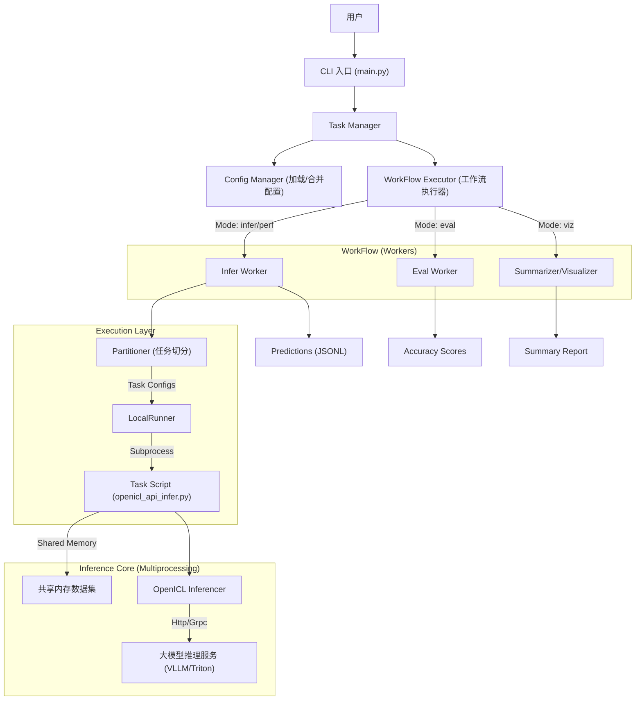

# AISBench 架构分析报告

## 1. 项目概览

**AISBench Benchmark** 是一个面向大模型（LLM）的综合评测工具，主要基于 [OpenCompass](https://github.com/open-compass/opencompass) 构建，但在其基础上进行了深度定制，特别增强了对**服务化模型（Service-oriented Models）**的支持。

### 核心特性
- **双重模式**：支持**精度评测**（基于数据集的问答准确率）和**性能评测**（吞吐量、延迟、RPS等）。
- **高并发架构**：针对服务化推理场景，底层采用多进程+共享内存机制，支持高并发请求发送。
- **插件化设计**：通过 Registry 机制管理模型、数据集、运行器等组件，易于扩展。
- **全面兼容**：支持 VLLM, Triton, TGI 等主流推理服务框架。

---

## 2. 系统架构设计

本项目采用分层架构，数据流从 CLI 入口层层传递至底层的模型执行单元。

### 2.1 核心层级流转图



### 2.2 核心流程解析

1.  **配置解析 (CLI & Config)**:
    *   用户通过 `ais_bench --models ... --datasets ...` 启动。
    *   `TaskManager` 调用 `ConfigManager` 加载对应的 Python 配置文件。
    *   系统根据运行模式（`infer`, `eval`, `perf`）组装工作流（Workflow）。

2.  **任务调度 (Workers & Runners)**:
    *   `Worker`（如 `Infer`）负责准备具体的任务配置，并调用 `Partitioner`（默认 `NaivePartitioner`）将大任务切分为子任务。
    *   `LocalRunner` 接收任务列表，使用线程池（ThreadPoolExecutor）管理任务的并发提交。
    *   **关键机制**：`LocalRunner` 不会直接在当前进程执行模型代码，而是将配置 dump 为临时文件，然后通过 `subprocess.Popen` 启动一个新的 Python 进程来执行具体的 Task 脚本（如 `ais_bench/benchmark/tasks/openicl_api_infer.py`）。

3.  **高并发推理 (Tasks & Inferencer)**:
    *   在子进程中，`OpenICLApiInferTask` 启动。
    *   **性能优化**：为了支持高并发压测，Task 使用 `multiprocessing` 启动多个 Worker 进程。
    *   **数据共享**：主进程将数据集序列化到 **Shared Memory (共享内存)**，子进程直接从共享内存读取数据，避免了进程间通信的大量开销。
    *   `TokenProducer` 负责控制请求速率（Rate Limiting），模拟真实流量压力。

---

## 3. 核心模块说明

| 模块 | 路径 | 作用 |
| :--- | :--- | :--- |
| **Registry** | `ais_bench/benchmark/registry.py` | 核心注册中心，管理所有插件（Models, Datasets, Runners）。基于 `mmengine.registry`。 |
| **CLI** | `ais_bench/benchmark/cli/` | 程序入口，负责参数解析、工作流编排 (`workers.py`)。 |
| **Runners** | `ais_bench/benchmark/runners/` | 任务执行器。`LocalRunner` 负责本地多任务调度，核心是管理 GPU/NPU 资源并启动子进程。 |
| **Tasks** | `ais_bench/benchmark/tasks/` | 具体的执行逻辑。`OpenICLApiInferTask` 是服务化推理的核心，实现了多进程共享内存架构。 |
| **Models** | `ais_bench/benchmark/models/` | 模型接口抽象。分为 `local_models` (HuggingFace) 和 `api_models` (VLLM, Triton)。 |
| **Inferencer** | `ais_bench/benchmark/openicl/` | 推理核心逻辑，负责将 Dataset 中的数据转换为 Prompt 并发送给 Model。 |
| **Calculators** | `ais_bench/benchmark/calculators/` | 性能指标计算（TPS, Latency, TTFT 等）。 |
| **Summarizers** | `ais_bench/benchmark/summarizers/` | 结果汇总，生成 CSV/Markdown 报告。 |

---

## 4. 核心 Worker 机制解析

`ais_bench/benchmark/cli/workers.py` 定义了评测流程中的核心执行单元。`WorkFlowExecutor` 根据运行模式（如 `infer` 或 `perf`）调度这些 Worker。

### 4.1 核心 Worker 详解

#### 1. `Infer` (推理工作者)
**核心职责**：调用模型进行数据推理，生成预测结果。
*   **任务类型判断**：检查配置中的模型属性。若为服务化模型 (`attr="service"`)，使用 `OpenICLApiInferTask`（支持多进程+共享内存高并发）；本地模型则使用 `OpenICLInferTask`。
*   **任务切分与执行**：调用 `Partitioner` 切分任务，通过 `Runner` 调度执行。
*   **性能评测优化**：在 `perf` 模式下，执行 `_merge_datasets`，将相同配置的数据集任务合并，以消除任务切换开销，确保持续高并发压力。

#### 2. `Eval` (评估工作者)
**核心职责**：对推理生成的预测结果与标准答案进行比对。
*   **流程**：配置 `OpenICLEvalTask`，生成中间评估结果（存放在 `results/` 目录）。
*   **注意**：在性能评测模式下通常跳过此步骤。

#### 3. `AccViz` (精度结果汇总)
**核心职责**：汇总 `Eval` 阶段数据，生成精度报告。
*   **产出**：CSV/Markdown 报告，计算 Accuracy, F1 Score 等指标。
*   **支持**：包含对主观评测（Subjective Evaluation）的特殊汇总逻辑。

#### 4. `PerfViz` (性能结果汇总)
**核心职责**：计算和展示性能评测指标（仅在 `perf` 模式下工作）。
*   **产出**：计算 **TPS** (Tokens Per Second), **TTFT**, **Latency**, **RPS** 等关键指标，生成性能分析报告。

### 4.2 工作流编排 (WorkFlow)

| 模式 (`--mode`) | 执行链 (Pipeline) | 说明 |
| :--- | :--- | :--- |
| **all** (默认) | `Infer` -> `Eval` -> `AccViz` | 完整精度评测流程 |
| **perf** | `Infer` -> `PerfViz` | 性能评测流程（跳过算分） |
| **infer** | `Infer` | 仅执行推理 |
| **eval** | `Eval` -> `AccViz` | 仅算分和汇总 |

---

## 5. 精度评测 vs 性能评测

在 AISBench 中，两者的目标、关注点及底层逻辑存在本质区别：

| 维度 | 精度测量 (Accuracy) | 性能测量 (Performance) |
| :--- | :--- | :--- |
| **核心问题** | **“模型回答得对不对？”** | **“模型回答得快不快？系统能抗多大压？”** |
| **关注指标** | Accuracy, Pass@k, ROUGE, BLEU | TPS, TTFT, Latency, QPS/RPS |
| **是否合并任务** | **否** (独立计算各数据集分数) | **是** (合并以维持持续压力，测出峰值性能) |
| **对服务端压力** | 较低 (关注单条质量) | **极高** (模拟真实高并发流量) |
| **执行流程** | `Infer` -> `Eval` -> `AccViz` | `Infer` -> `PerfViz` (跳过 `Eval`) |
| **启动命令** | `ais_bench ...` | `ais_bench --mode perf ...` |

---

## 6. 模型加载与配置机制

AISBench 采用 **Configuration as Code** 的设计模式，将模型实现与配置分离。

### 6.1 目录职责
*   **实现层 (`benchmark/models/`)**: 定义模型的 Python 类（如 `VLLMCustomAPIChat`, `HuggingFace`），实现具体的推理逻辑。
*   **配置层 (`configs/models/`)**: 定义具体的 Python 配置文件（如 `qwen.py`），实例化模型类并填充参数（如 IP、端口、并发数）。

### 6.2 动态加载流程
当执行 `ais_bench --models qwen` 时：
1.  **搜索**: 系统在 `configs/models/` 下查找 `qwen.py`。
2.  **执行**: 动态运行该 Python 脚本。
3.  **注入**: 提取脚本中定义的 `models` 列表，将其注入到 `ConfigManager` 中。
4.  **实例化**: 根据配置中的 `type` 字段（如 `type=MaaSAPI`）实例化对应的模型类。

这种机制允许用户在配置文件中使用 Python 代码（如循环生成配置、环境变量读取），极大地提升了灵活性。

---

## 7. 如何运行一个新的测评任务

如果你想测试一个新的大模型测评任务，请遵循以下步骤：

### 第一步：准备模型配置
在 `ais_bench/benchmark/configs/models/` 下创建或复用配置文件。
例如 `vllm_api_new.py`:
```python
from ais_bench.benchmark.models import VLLMCustomAPIChat

models = [
    dict(
        attr="service",
        type=VLLMCustomAPIChat,
        abbr='vllm-new-model',
        host_ip="127.0.0.1",
        host_port=8000,
        batch_size=16,  # 并发数
        generation_kwargs=dict(temperature=0.0)
    )
]
```

### 第二步：准备数据集
确保数据集已在 `ais_bench/benchmark/configs/datasets/` 中定义。如果是自定义数据集，需要配置加载器和评估指标。

### 第三步：启动推理服务
确保你的大模型服务（如 VLLM）已经启动并监听在配置文件指定的端口。

### 第四步：执行命令
使用 CLI 启动评测：

```bash
# 精度评测 (默认)
ais_bench --models vllm_api_new --datasets demo_gsm8k_chat

# 性能评测 (指定 --mode perf)
ais_bench --mode perf --models vllm_api_new --datasets demo_gsm8k_chat
```

### 第五步：查看结果
执行完成后，结果位于 `outputs/default/{timestamp}/` 目录下：
*   `logs/`: 运行日志。
*   `predictions/`: 模型输出的原始 JSONL 文件。
*   `results/`: 精度计算结果。
*   `summary/`: 最终的性能或精度汇总报告。

## 8. 总结

AISBench 的架构设计非常适合**生产环境的模型服务评测**。它通过**进程隔离**保证了评测任务的独立性，通过**共享内存**保证了高并发下的数据吞吐能力，能够真实模拟线上流量对大模型服务进行压力测试。
