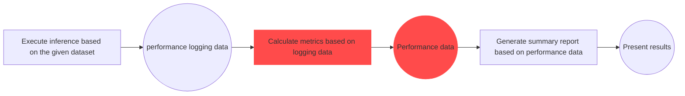

# Service-Oriented Steady-State Performance Testing

## Basic Introduction
### Concept Explanation
**Steady-state performance testing** (hereinafter referred to as "steady-state testing") is designed to simulate real-world business scenarios of inference services and test the performance of inference services when they are in a stable state.

A **steady state** refers to a state where an inference service can simultaneously process requests and remain stable when the number of concurrent requests reaches its maximum.


### Differences from Conventional Performance Testing
The only difference between steady-state testing and 📚 [conventional service-oriented performance testing](../base_tutorials/scenes_intro/performance_benchmark.md) lies in the **method of calculating performance data**:




### Explanation of Performance Data Calculation in the Steady Stage
**The steady-stage performance data calculated by AISBench essentially comes from all requests processed during this stage**.<br>
When the number of concurrent requests being processed by the inference service reaches the maximum concurrency level, the system can be considered to be in the steady stage. The ideal trend of the number of concurrent requests processed by the inference service over test time is shown in the figure below:


- **Traffic Ramp-Up Stage**: The number of clients connected to the inference service increases continuously, and the number of concurrent requests processed by the service also increases accordingly.
- **Actual Steady Stage**: The number of concurrent requests processed by the inference service reaches the maximum concurrency level.
- **Calculated Steady Stage**: The time period from the moment (`t2`) when the number of concurrent requests processed by the inference service first reaches the maximum concurrency level (i.e., the sending time of the first request after reaching max concurrency) to the moment (`t4`) when the number of concurrent requests last remains at the maximum concurrency level. The tool treats all requests whose start time falls within this period as "steady-stage requests".<br> The "Benchmark Duration" in performance metrics refers to the time delay of this stage.<br> **Note**: Since Benchmark Duration is used to calculate throughput, the resulting throughput may contain errors. These errors arise from differences in computing resource usage between: 1) requests before `t0` to `t2` (not included in the steady stage) and 2) requests between `t4` to `t5` (incorrectly included in the steady stage). Additionally, this discrepancy may cause the "Concurrency" metric to exceed "Max Concurrency", but the "Concurrency" value will still be displayed as "Max Concurrency". The calculated throughput data is only sufficiently reliable if the maximum single-request latency (E2EL, End-to-End Latency) during the entire test is less than 1/3 of the Benchmark Duration.
- **Request Sending Stage**: During this stage, the tool continuously sends requests to the inference service. After this stage, the tool waits for all requests to return.
- **Traffic Ramp-Down Stage**: The number of concurrent requests processed by the inference service decreases continuously until all requests are finally returned.


## Quick Start for Steady-State Testing
### Command Explanation
The commands for steady-state testing are the same as those explained in 📚 [Quick Start for Service-Oriented Performance Evaluation / Command Meaning](../base_tutorials/scenes_intro/performance_benchmark.md#command-meaning). On this basis, you need to specify `--summarizer stable_stage` to calculate performance data in the steady-state manner. Take the following AISBench command as an example:

```shell
ais_bench --models vllm_api_general_chat --datasets demo_gsm8k_gen_4_shot_cot_chat_prompt --summarizer stable_stage --mode perf
```

Where:
- `--models` specifies the model task, i.e., the `vllm_api_stream_chat` model task.
- `--datasets` specifies the dataset task, i.e., the `demo_gsm8k_gen_4_shot_cot_chat_prompt` dataset task.
- `--summarizer` specifies the result presentation task, i.e., the `stable_stage` result presentation task.


### Preparations Before Running the Command
- **`--models`**: To use the `vllm_api_stream_chat` model task, you need to prepare an inference service that supports the `v1/chat/completions` sub-service. You can refer to 🔗 [Start an OpenAI-Compatible Server with VLLM](https://docs.vllm.com/en/latest/getting_started/quickstart.html#openai-compatible-server) to launch the inference service.
- **`--datasets`**: To use the `demo_gsm8k_gen_4_shot_cot_chat_prompt` dataset task, you need to prepare the GSM8K dataset. You can download it from 🔗 [the GSM8K dataset zip package provided by OpenCompass](http://opencompass.oss-cn-shanghai.aliyuncs.com/datasets/data/gsm8k.zip). Extract the `gsm8k/` folder and deploy it to the `ais_bench/datasets` folder in the root directory of the AISBench tool.


### Modifying Configuration Files for Corresponding Tasks
Each model task, dataset task, and result presentation task corresponds to a configuration file. These files need to be modified before running the command. You can query the paths of these configuration files by adding `--search` to the original AISBench command. For example:

```shell
# Whether to add "--mode perf" and "--pressure" to the search command does not affect the search results
ais_bench --models vllm_api_stream_chat --datasets demo_gsm8k_gen_4_shot_cot_chat_prompt --summarizer stable_stage --mode perf --pressure --search
```

> ⚠️ **Note**: Executing the command with `--search` will print the **absolute paths** of the configuration files corresponding to the tasks.


Executing the query command will yield results similar to the following:

```shell
06/28 11:52:25 - AISBench - INFO - Searching configs...
╒══════════════╤═══════════════════════════════════════╤═════════════════════════════════════════════════════════════════════════════════════════════════════════════════════════════════════╕
│ Task Type    │ Task Name                             │ Config File Path                                                                                                                    │
╞══════════════╪═══════════════════════════════════════╪═════════════════════════════════════════════════════════════════════════════════════════════════════════════════════════════════════╡
│ --models     │ vllm_api_stream_chat                  │ /your_workspace/ais_bench/benchmark/configs/models/vllm_api/vllm_api_stream_chat.py                                                 │
├──────────────┼───────────────────────────────────────┼─────────────────────────────────────────────────────────────────────────────────────────────────────────────────────────────────────┤
│ --datasets   │ demo_gsm8k_gen_4_shot_cot_chat_prompt │ /your_workspace/ais_bench/benchmark/configs/datasets/demo/demo_gsm8k_gen_4_shot_cot_chat_prompt.py                                  │
├──────────────┼───────────────────────────────────────┼─────────────────────────────────────────────────────────────────────────────────────────────────────────────────────────────────────┤
│ --summarizer │ stable_stage                          │ /your_workspace/ais_bench/benchmark/configs/summarizers/perf/stable_stage.py                                                        │
╘══════════════╧═══════════════════════════════════════╧═════════════════════════════════════════════════════════════════════════════════════════════════════════════════════════════════════╛
```


- The dataset task configuration file `demo_gsm8k_gen_4_shot_cot_chat_prompt.py` in this quick start does not require additional modifications. For an introduction to the content of dataset task configuration files, refer to 📚 [Open-Source Datasets](../base_tutorials/all_params/datasets.md#open-source-datasets).

The model configuration file `vllm_api_stream_chat.py` contains configuration settings related to model operation and **needs to be modified according to actual conditions**. The content to be modified in this quick start is marked with comments:

```python
from ais_bench.benchmark.models import VLLMCustomAPIChatStream

models = [
    dict(
        attr="service",
        type=VLLMCustomAPIChatStream,
        abbr='vllm-api-stream-chat',
        path="",                    # Specify the absolute path to the model's serialized vocabulary file (usually the path to the model weight folder)
        model="DeepSeek-R1",        # Specify the name of the model loaded on the server; configure it according to the actual model name pulled by the VLLM inference service (leave empty to auto-detect)
        request_rate = 0,           # Invalid in stress testing scenarios
        retry = 2,
        host_ip = "localhost",      # Specify the IP address of the inference service
        host_port = 8080,           # Specify the port of the inference service
        max_out_len = 512,          # Maximum number of tokens output by the inference service
        batch_size=3,               # Maximum concurrency for request sending
        generation_kwargs = dict(
            temperature = 0.5,
            top_k = 10,
            top_p = 0.95,
            seed = None,
            repetition_penalty = 1.03,
            ignore_eos = True,      # The inference service ignores EOS (end-of-sequence token), so the output length will always reach max_out_len
        )
    )
]
```


### Executing the Command
After modifying the configuration files, execute the following command to start the service-oriented performance test (⚠️ It is recommended to add `--debug` for the first execution to print detailed logs to the screen, which helps troubleshoot errors during request inference):

```bash
# Add --debug to the command line
ais_bench --models vllm_api_stream_chat --datasets demo_gsm8k_gen_4_shot_cot_chat_prompt --summarizer stable_stage --mode perf  --debug
```


### Viewing Performance Results
An example of the on-screen performance result output is as follows:

```bash
06/05 20:22:24 - AISBench - INFO - Performance Results of task: vllm-api-stream-chat/gsm8kdataset:

╒══════════════════════════╤═════════╤══════════════════╤══════════════════╤══════════════════╤══════════════════╤══════════════════╤══════════════════╤══════════════════╤══════╕
│ Performance Parameters   │ Stage   │ Average          │ Min              │ Max              │ Median           │ P75              │ P90              │ P99              │  N   │
╞══════════════════════════╪═════════╪══════════════════╪══════════════════╪══════════════════╪══════════════════╪══════════════════╪══════════════════╪══════════════════╪══════╡
│ E2EL                     │ stable  │ 2048.2945  ms    │ 1729.7498 ms     │ 3450.96 ms       │ 2491.8789 ms     │ 2750.85 ms       │ 3184.9186 ms     │ 3424.4354 ms     │ 8    │
├──────────────────────────┼─────────┼──────────────────┼──────────────────┼──────────────────┼──────────────────┼──────────────────┼──────────────────┼──────────────────┼──────┤
│ TTFT                     │ stable  │ 50.332 ms        │ 50.6244 ms       │ 52.0585 ms       │ 50.3237 ms       │ 50.5872 ms       │ 50.7566 ms       │ 50.0551 ms       │ 8    │
├──────────────────────────┼─────────┼──────────────────┼──────────────────┼──────────────────┼──────────────────┼──────────────────┼──────────────────┼──────────────────┼──────┤
│ TPOT                     │ stable  │ 10.6965 ms       │ 10.061 ms        │ 10.8805 ms       │ 10.7495 ms       │ 10.7818 ms       │ 10.808 ms        │ 10.8582 ms       │ 8    │
├──────────────────────────┼─────────┼──────────────────┼──────────────────┼──────────────────┼──────────────────┼──────────────────┼──────────────────┼──────────────────┼──────┤
│ ITL                      │ stable  │ 10.6965 ms       │ 7.3583 ms        │ 13.7707 ms       │ 10.7513 ms       │ 10.8009 ms       │ 10.8358 ms       │ 10.9322 ms       │ 8    │
├──────────────────────────┼─────────┼──────────────────┼──────────────────┼──────────────────┼──────────────────┼──────────────────┼──────────────────┼──────────────────┼──────┤
│ InputTokens              │ stable  │ 1512.5           │ 1481.0           │ 1566.0           │ 1511.5           │ 1520.25          │ 1536.6           │ 1563.06          │ 8    │
├──────────────────────────┼─────────┼──────────────────┼──────────────────┼──────────────────┼──────────────────┼──────────────────┼──────────────────┼──────────────────┼──────┤
│ OutputTokens             │ stable  │ 287.375          │ 200.0            │ 407.0            │ 280.0            │ 322.75           │ 374.8            │ 403.78           │ 8    │
├──────────────────────────┼─────────┼──────────────────┼──────────────────┼──────────────────┼──────────────────┼──────────────────┼──────────────────┼──────────────────┼──────┤
│ OutputTokenThroughput    │ stable  │ 115.9216 token/s │ 107.6555 token/s │ 116.5352 token/s │ 117.6448 token/s │ 118.2426 token/s │ 118.3765 token/s │ 118.6388 token/s │ 8    │
╘══════════════════════════╧═════════╧══════════════════╧══════════════════╧══════════════════╧══════════════════╧══════════════════╧══════════════════╧══════════════════╧══════╛
╒══════════════════════════╤═════════╤════════════════════╕
│ Common Metric            │ Stage   │ Value              │
╞══════════════════════════╪═════════╪════════════════════╡
│ Benchmark Duration       │ stable  │ 19897.8505 ms      │
├──────────────────────────┼─────────┼────────────────────┤
│ Total Requests           │ stable  │ 8                  │
├──────────────────────────┼─────────┼────────────────────┤
│ Failed Requests          │ stable  │ 0                  │
├──────────────────────────┼─────────┼────────────────────┤
│ Success Requests         │ stable  │ 8                  │
├──────────────────────────┼─────────┼────────────────────┤
│ Concurrency              │ stable  │ 0.9972             │
├──────────────────────────┼─────────┼────────────────────┤
│ Max Concurrency          │ stable  │ 1                  │
├──────────────────────────┼─────────┼────────────────────┤
│ Request Throughput       │ stable  │ 0.4021 req/s       │
├──────────────────────────┼─────────┼────────────────────┤
│ Total Input Tokens       │ stable  │ 12100              │
├──────────────────────────┼─────────┼────────────────────┤
│ Prefill Token Throughput │ stable  │ 17014.3123 token/s │
├──────────────────────────┼─────────┼────────────────────┤
│ Total generated tokens   │ stable  │ 2299               │
├──────────────────────────┼─────────┼────────────────────┤
│ Input Token Throughput   │ stable  │ 608.7438 token/s   │
├──────────────────────────┼─────────┼────────────────────┤
│ Output Token Throughput  │ stable  │ 115.7835 token/s   │
├──────────────────────────┼─────────┼────────────────────┤
│ Total Token Throughput   │ stable  │ 723.5273 token/s   │
╘══════════════════════════╧═════════╧════════════════════╛

06/05 20:22:24 - AISBench - INFO - Performance Result files locate in outputs/default/20250605_202220/performances/vllm-api-stream-chat.

```
💡 For the meaning of specific performance parameters, please refer to 📚 [Explanation of Performance Test Results](../base_tutorials/results_intro/performance_metric.md)


### Viewing Performance Details
After executing the AISBench command, more details about the task execution are finally saved to the default output path. This output path is indicated in the on-screen log during runtime, for example:
```shell
06/28 15:13:26 - AISBench - INFO - Current exp folder: outputs/default/20250628_151326
```
This log indicates that the task execution details are saved in `outputs/default/20250628_151326` under the directory where the command is executed.

After the command execution is completed, the task execution details in `outputs/default/20250628_151326` are as follows:
```shell
20250628_151326           # Unique directory generated based on timestamp for each experiment
├── configs               # Automatically stored dumped configuration files
├── logs                  # Runtime logs; if --debug is added to the command, no runtime logs will be saved to disk (all logs are printed directly to the screen)
│   └── performance/      # Log files of the inference stage
└── performance           # Performance test results
│    └── vllm-api-stream-chat/          # Name of the "service-oriented model configuration", corresponding to the `abbr` parameter of `models` in the model task configuration file
│         ├── gsm8kdataset.csv          # Per-request performance output (CSV), consistent with the "Performance Parameters" table in the on-screen performance results
│         ├── gsm8kdataset.json         # End-to-end performance output (JSON), consistent with the "Common Metric" table in the on-screen performance results
│         ├── gsm8kdataset_details.h5 # ITL data from complete logging
│         ├── gsm8kdataset_details.json # Detailed complete logging information
│         └── gsm8kdataset_plot.html    # Request concurrency visualization report (HTML)
```
💡 It is recommended to open the `gsm8kdataset_plot.html` (request concurrency visualization report) using browsers such as Chrome or Edge. This report allows you to view the latency of each request and the number of concurrent service processing requests perceived by the client at each moment:
  
For instructions on how to view the charts in this HTML file, please refer to 📚 [Instructions for Using Performance Test Visualization Concurrency Charts](../base_tutorials/results_intro/performance_visualization.md)


## Other Functional Scenarios
### Recalculating Performance Results
Refer to 📚 [Recalculation of Performance Results](../base_tutorials/scenes_intro/performance_benchmark.md#recalculation-of-performance-results)

#### Configuration Differences
Modify the configuration file `stable_stage.py` corresponding to the `stable_stage` result presentation task specified by `--summarizer`.

In the recalculation command, also specify `--summarizer stable_stage`.

> 💡 Results obtained from conventional performance tests can also be directly recalculated by specifying `--summarizer stable_stage`.


## Enabling Steady-State Testing with Stress Testing
If the dataset used for your performance test is too small to bring the service into a steady state, you can use the **stress testing** capability of the AISBench tool to make the tested service reach a steady state.

### Request Sending Method for Performance Stress Testing
Stress testing aims to simulate multiple clients sending requests continuously. It increases the test pressure by gradually increasing the number of clients. When the number of clients finally reaches the maximum concurrency level, the inference service officially enters a steady state (as shown in the figure below). The entire stress testing process lasts for a fixed period, during which the dataset content is continuously polled to construct requests, ensuring that the steady state is maintained for a certain duration.


### Quick Start for Stress Testing
The process of stress testing is basically the same as that of [Quick Start for Steady-State Testing](#quick-start-for-steady-state-testing), with the main differences in the following two aspects:

#### Stress Testing Parameter Description
Specify the duration of stress testing through the command-line parameter `--pressure-time`. The stress testing duration cannot exceed 86400 seconds (24 hours).

Specify the frequency of adding new threads (clients) per process by configuring the `request_rate` parameter in the [model configuration file](../base_tutorials/all_params/models.md#parameter-description-for-service-oriented-inference-backend-configuration). The larger the value of this parameter, the greater the deviation in the actual frequency of adding new threads (clients) (the deviation is related to the single-core processing capability of the CPU).

Specify the number of processes used in stress testing by modifying the `WORKERS_NUM` parameter in the [global constants configuration file](../base_tutorials/all_params/cli_args.md#configuration-constant-file-parameters) to improve the concurrency capability of stress testing.

#### Adding Stress Testing Command
Add `--pressure` to the command line:
```bash
# Add --debug to the command line
ais_bench --models vllm_api_stream_chat --datasets demo_gsm8k_gen_4_shot_cot_chat_prompt --summarizer stable_stage --mode perf --pressure --pressure-time 30
```