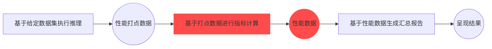

# 服务化稳定状态性能测试
## 基本介绍
### 概念介绍
**稳定状态性能测试**（后续简称"稳态测试"）是为了模拟真实推理服务的业务场景，测试推理服务处于稳定状态下的性能。
**稳定状态**，是指推理服务在并发请求数量达到最大值时，能够同时处理且保持稳定的状态。

### 与常规性能测试的区别
稳态测试与📚 [常规服务化性能测试](../base_tutorials/scenes_intro/performance_benchmark.md)区别在于仅在于**性能数据的计算方式**不同：


### 稳定阶段性能数据计算方式说明
**AISBench计算的稳定阶段性能数据，本质上是来源于处于该阶段所有请求**。<br>
当推理服务同时在处理的请求数量达到最大并发数时，可以认为系统处于稳定阶段，推理服务同时在处理的请求数量随测试时间的变化图理想状态如下：


- **流量爬坡阶段:** 与推理服务建立连接的客户端数量在不断增加，服务同时处理的请求数也同步增加。
- **实际稳态阶段:** 推理服务同时在处理的请求数量达到最大并发数。
- **计算稳态阶段:** 推理服务同时在处理的请求数量首次达到最大并发数后的第一条请求发送的时间点(t2)至推理服务同时在处理的请求数量最后处于最大并发数(t4)的阶段。工具将开始时间处于这个阶段的所有请求都视为稳定阶段的请求。<br>性能指标中的Benchmark Duration指的就是这个阶段的时延。<br> **注意**，由于Benchmark Duration会用于计算吞吐率，计算出的吞吐率会存在误差，误差是由于t0至t2之间未算入稳态的请求和t4至t5中被纳入稳态阶段的请求占用的计算资源差异导致的。同时，此差异可能会导致性能指标中的Concurrency的计算结果超过Max Concurrency，但是Concurrency依然显示为Max Concurrency的取值。只有当整个测试过程的最大的单请求时延E2EL(End-to-End-Latency)小于Benchmark Duration的1/3时，计算出的吞吐数据置信度才足够。
- **发送请求阶段:** 此阶段工具在不断给推理服务发送请求，此阶段后工具会等待所有请求返回。
- **流量退出阶段:** 推理服务同时处理的请求数量在不断降低，直到最终所有请求都返回。

## 稳态测试快速入门
### 命令含义
稳态测试与📚 [服务化性能测评快速入门/命令含义](../base_tutorials/scenes_intro/performance_benchmark.md#命令含义)中的解释相同。在此基础上需要指定`--summarizer stable_stage`按照稳态方式统计性能数据，，以如下AISBench命令为例：
```shell
ais_bench --models vllm_api_stream_chat --datasets demo_gsm8k_gen_4_shot_cot_chat_prompt --summarizer stable_stage --mode perf
```
其中：
- `--models`指定了模型任务，即`vllm_api_stream_chat`模型任务。

- `--datasets`指定了数据集任务，即`demo_gsm8k_gen_4_shot_cot_chat_prompt`数据集任务。

- `--summarizer`指定了结果呈现任务，即`stable_stage`结果呈现任务。

### 运行命令前置准备
- `--models`: 使用`vllm_api_stream_chat`模型任务，需要准备支持`v1/chat/completions`子服务的推理服务，可以参考🔗 [VLLM启动OpenAI 兼容服务器](https://docs.vllm.com.cn/en/latest/getting_started/quickstart.html#openai-compatible-server)启动推理服务
- `--datasets`: 使用`demo_gsm8k_gen_4_shot_cot_chat_prompt`数据集任务，需要准备gsm8k数据集，可以从🔗 [opencompass
提供的gsm8k数据集压缩包](http://opencompass.oss-cn-shanghai.aliyuncs.com/datasets/data/gsm8k.zip)下载。将解压后的`gsm8k/`文件夹部署到AISBench评测工具根路径下的`ais_bench/datasets`文件夹下。

### 任务对应配置文件修改
每个模型任务、数据集任务和结果呈现任务都对应一个配置文件，运行命令前需要修改这些配置文件的内容。这些配置文件路径可以通过在原有AISBench命令基础上加上`--search`来查询，例如：
```shell
# 注意search的命令中是否加 "--mode perf"和"--pressure" 不影响搜索结果
ais_bench --models vllm_api_stream_chat --datasets demo_gsm8k_gen_4_shot_cot_chat_prompt --summarizer stable_stage --mode perf --pressure --search
```
> ⚠️ **注意**： 执行带search命令会打印出任务对应的配置文件的绝对路径。

执行查询命令可以得到如下查询结果：
```shell
06/28 11:52:25 - AISBench - INFO - Searching configs...
╒══════════════╤═══════════════════════════════════════╤═════════════════════════════════════════════════════════════════════════════════════════════════════════════════════════════════════╕
│ Task Type    │ Task Name                             │ Config File Path                                                                                                                    │
╞══════════════╪═══════════════════════════════════════╪═════════════════════════════════════════════════════════════════════════════════════════════════════════════════════════════════════╡
│ --models     │ vllm_api_stream_chat                  │ /your_workspace/ais_bench/benchmark/configs/models/vllm_api/vllm_api_stream_chat.py                                                 │
├──────────────┼───────────────────────────────────────┼─────────────────────────────────────────────────────────────────────────────────────────────────────────────────────────────────────┤
│ --datasets   │ demo_gsm8k_gen_4_shot_cot_chat_prompt │ /your_workspace/ais_bench/benchmark/configs/datasets/demo/demo_gsm8k_gen_4_shot_cot_chat_prompt.py                                  │
├──────────────┼───────────────────────────────────────┼─────────────────────────────────────────────────────────────────────────────────────────────────────────────────────────────────────┤
│ --summarizer │ stable_stage                          │ /your_workspace/ais_bench/benchmark/configs/summarizers/perf/stable_stage.py                                                        │
╘══════════════╧═══════════════════════════════════════╧═════════════════════════════════════════════════════════════════════════════════════════════════════════════════════════════════════╛

```

- 快速入门中数据集任务配置文件`demo_gsm8k_gen_4_shot_cot_chat_prompt.py`不需要做额外修改，数据集任务配置文件内容介绍可参考📚 [配置开源数据集](../base_tutorials/all_params/datasets.md#配置开源数据集)

模型配置文件`vllm_api_stream_chat.py`中包含了模型运行相关的配置内容，是需要依据实际情况修改的。快速入门中需要修改的内容用注释标明。
```python
from ais_bench.benchmark.models import VLLMCustomAPIChatStream

models = [
    dict(
        attr="service",
        type=VLLMCustomAPIChatStream,
        abbr='vllm-api-stream-chat',
        path="",                    # 指定模型序列化词表文件绝对路径，一般来说就是模型权重文件夹路径
        model="DeepSeek-R1",        # 指定服务端已加载模型名称，依据实际VLLM推理服务拉取的模型名称配置（配置成空字符串会自动获取）
        request_rate = 0,           # 压力测试场景下不生效
        retry = 2,
        host_ip = "localhost",      # 指定推理服务的IP
        host_port = 8080,           # 指定推理服务的端口
        max_out_len = 512,          # 推理服务输出的token的最大数量
        batch_size=3,               # 请求发送的最大并发数
        generation_kwargs = dict(
            temperature = 0.5,
            top_k = 10,
            top_p = 0.95,
            seed = None,
            repetition_penalty = 1.03,
            ignore_eos = True,      # 推理服务输出忽略eos（输出长度一定会达到max_out_len）
        )
    )
]
```
### 执行命令
修改好配置文件后，执行命令启动服务化性能评测（⚠️ 第一次执行建议加上`--debug`，可以将具体日志打屏，如果有请求推理服务过程中的报错更方便处理）：
```bash
# 命令行加上--debug
ais_bench --models vllm_api_stream_chat --datasets demo_gsm8k_gen_4_shot_cot_chat_prompt --summarizer stable_stage --mode perf  --debug
```
### 查看性能结果
性能结果打屏示例如下：

```bash
06/05 20:22:24 - AISBench - INFO - Performance Results of task: vllm-api-stream-chat/gsm8kdataset:

╒══════════════════════════╤═════════╤══════════════════╤══════════════════╤══════════════════╤══════════════════╤══════════════════╤══════════════════╤══════════════════╤══════╕
│ Performance Parameters   │ Stage   │ Average          │ Min              │ Max              │ Median           │ P75              │ P90              │ P99              │  N   │
╞══════════════════════════╪═════════╪══════════════════╪══════════════════╪══════════════════╪══════════════════╪══════════════════╪══════════════════╪══════════════════╪══════╡
│ E2EL                     │ stable  │ 2048.2945  ms    │ 1729.7498 ms     │ 3450.96 ms       │ 2491.8789 ms     │ 2750.85 ms       │ 3184.9186 ms     │ 3424.4354 ms     │ 8    │
├──────────────────────────┼─────────┼──────────────────┼──────────────────┼──────────────────┼──────────────────┼──────────────────┼──────────────────┼──────────────────┼──────┤
│ TTFT                     │ stable  │ 50.332 ms        │ 50.6244 ms       │ 52.0585 ms       │ 50.3237 ms       │ 50.5872 ms       │ 50.7566 ms       │ 50.0551 ms       │ 8    │
├──────────────────────────┼─────────┼──────────────────┼──────────────────┼──────────────────┼──────────────────┼──────────────────┼──────────────────┼──────────────────┼──────┤
│ TPOT                     │ stable  │ 10.6965 ms       │ 10.061 ms        │ 10.8805 ms       │ 10.7495 ms       │ 10.7818 ms       │ 10.808 ms        │ 10.8582 ms       │ 8    │
├──────────────────────────┼─────────┼──────────────────┼──────────────────┼──────────────────┼──────────────────┼──────────────────┼──────────────────┼──────────────────┼──────┤
│ ITL                      │ stable  │ 10.6965 ms       │ 7.3583 ms        │ 13.7707 ms       │ 10.7513 ms       │ 10.8009 ms       │ 10.8358 ms       │ 10.9322 ms       │ 8    │
├──────────────────────────┼─────────┼──────────────────┼──────────────────┼──────────────────┼──────────────────┼──────────────────┼──────────────────┼──────────────────┼──────┤
│ InputTokens              │ stable  │ 1512.5           │ 1481.0           │ 1566.0           │ 1511.5           │ 1520.25          │ 1536.6           │ 1563.06          │ 8    │
├──────────────────────────┼─────────┼──────────────────┼──────────────────┼──────────────────┼──────────────────┼──────────────────┼──────────────────┼──────────────────┼──────┤
│ OutputTokens             │ stable  │ 287.375          │ 200.0            │ 407.0            │ 280.0            │ 322.75           │ 374.8            │ 403.78           │ 8    │
├──────────────────────────┼─────────┼──────────────────┼──────────────────┼──────────────────┼──────────────────┼──────────────────┼──────────────────┼──────────────────┼──────┤
│ OutputTokenThroughput    │ stable  │ 115.9216 token/s │ 107.6555 token/s │ 116.5352 token/s │ 117.6448 token/s │ 118.2426 token/s │ 118.3765 token/s │ 118.6388 token/s │ 8    │
╘══════════════════════════╧═════════╧══════════════════╧══════════════════╧══════════════════╧══════════════════╧══════════════════╧══════════════════╧══════════════════╧══════╛
╒══════════════════════════╤═════════╤════════════════════╕
│ Common Metric            │ Stage   │ Value              │
╞══════════════════════════╪═════════╪════════════════════╡
│ Benchmark Duration       │ stable  │ 19897.8505 ms      │
├──────────────────────────┼─────────┼────────────────────┤
│ Total Requests           │ stable  │ 8                  │
├──────────────────────────┼─────────┼────────────────────┤
│ Failed Requests          │ stable  │ 0                  │
├──────────────────────────┼─────────┼────────────────────┤
│ Success Requests         │ stable  │ 8                  │
├──────────────────────────┼─────────┼────────────────────┤
│ Concurrency              │ stable  │ 0.9972             │
├──────────────────────────┼─────────┼────────────────────┤
│ Max Concurrency          │ stable  │ 1                  │
├──────────────────────────┼─────────┼────────────────────┤
│ Request Throughput       │ stable  │ 0.4021 req/s       │
├──────────────────────────┼─────────┼────────────────────┤
│ Total Input Tokens       │ stable  │ 12100              │
├──────────────────────────┼─────────┼────────────────────┤
│ Prefill Token Throughput │ stable  │ 17014.3123 token/s │
├──────────────────────────┼─────────┼────────────────────┤
│ Total generated tokens   │ stable  │ 2299               │
├──────────────────────────┼─────────┼────────────────────┤
│ Input Token Throughput   │ stable  │ 608.7438 token/s   │
├──────────────────────────┼─────────┼────────────────────┤
│ Output Token Throughput  │ stable  │ 115.7835 token/s   │
├──────────────────────────┼─────────┼────────────────────┤
│ Total Token Throughput   │ stable  │ 723.5273 token/s   │
╘══════════════════════════╧═════════╧════════════════════╛

06/05 20:22:24 - AISBench - INFO - Performance Result files locate in outputs/default/20250605_202220/performances/vllm-api-stream-chat.

```
💡 具体性能参数的含义请参考📚 [性能测评结果说明](../base_tutorials/results_intro/performance_metric.md)


### 性能细节查看
执行AISBench命令后，任务执行更多细节最终会落盘在默认的输出路径，这个输出路径在运行中的打屏日志中有提示，例如：
```shell
06/28 15:13:26 - AISBench - INFO - Current exp folder: outputs/default/20250628_151326
```
这段日志说明任务执行的细节落盘在执行命令的路径下的`outputs/default/20250628_151326`中。
命令执行结束后`outputs/default/20250628_151326`中的任务执行的细节如下所示：
```shell
20250628_151326           # 每次实验基于时间戳生成的唯一目录
├── configs               # 自动存储的所有已转储配置文件
├── logs                  # 执行过程中日志，命令中如果加--debug，不会有过程日志落盘（都直接打印出来了）
│   └── performance/      # 推理阶段的日志文件
└── performance           # 性能测评结果
│    └── vllm-api-stream-chat/          # “服务化模型配置”名称，对应模型任务配置文件中models的 abbr参数
│         ├── gsm8kdataset.csv          # 单次请求性能输出（CSV），与性能结果打屏中的Performance Parameters表格一致
│         ├── gsm8kdataset.json         # 端到端性能输出（JSON），与性能结果打屏中的Common Metric表格一致
│         ├── gsm8kdataset_details.h5 # 完整打点中的ITL数据
│         ├── gsm8kdataset_details.json # 完整打点明细
│         └── gsm8kdataset_plot.html    # 请求并发可视化报告（HTML）
```
💡其中 `gsm8kdataset_plot.html`这个请求并发可视化报告建议使用Chrome或者Edge等浏览器打开，可以看到每个请求的时延以及每个时刻client端感知的服务时间并发数：
  
具体这个html中的图标如何查看请参考📚 [性能测试可视化并发图使用说明](../base_tutorials/results_intro/performance_visualization.md)

## 其他功能场景
### 性能结果重计算
参考📚 [常规性能测试性能结果重计算](../base_tutorials/scenes_intro/performance_benchmark.md#性能结果重计算)
#### 配置差异点
修改`--summarizer`指定的`stable_stage`结果呈现任务对应的配置文件`stable_stage.py`。
重计算的命令也将`--summarizer`指定为`stable_stage`。
> 💡 通过常规性能测试跑出的结果也可直接指定`--summarizer stable_stage`进行冲计算。

## 压力测试使能稳态测试
如果性能测评时使用的数据集规模太小，难以使服务达到稳定状态，可以使用AISBench评测工具的**压力测试**能力使被测服务达到稳定状态。
### 性能压力测试请求发送方式
压力测试旨在模拟多个客户端连续不断发送请求，通过不断增加客户端的数量来增加测试压力，最终客户端的数量达到最大并发数，推理服务就正式进入稳定状态(如下图所示)。整个压力测试过程持续固定时间，持续时间内不断轮询数据集内容构造请求，确保稳定状态能持续一定时间。

### 压力测试快速入门
压力测试的流程与[稳态测试快速入门](#稳态测试快速入门)基本一致，差异主要有如下两点：
#### 压力测试参数说明
通过命令参数`--pressure-time`和指定压力测试的持续时间，压测持续时间不能超过86400秒（24小时）。
通过配置[模型配置文件](../base_tutorials/all_params/models.md#配置模型)中的`request_rate`参数来指定每个进程新增线程（客户端）的频率。此参数取值越大，实际新增线程（客户端）的频率偏差越大（偏差和cpu单核处理能力有关）。
通过修改[配置常量文件参数](../base_tutorials/all_params/cli_args.md#配置常量文件参数)中的`WORKERS_NUM`参数来指定压力测试中使用的进程数,提高压力测试的并发能力。


#### 新增压测命令
命令行需要额外加上`--pressure`：
```bash
# 命令行加上--debug
ais_bench --models vllm_api_stream_chat --datasets demo_gsm8k_gen_4_shot_cot_chat_prompt --summarizer stable_stage --mode perf --pressure --pressure-time 30
```

